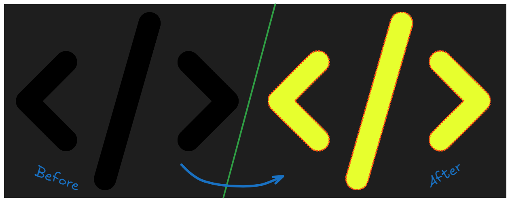
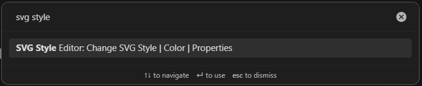
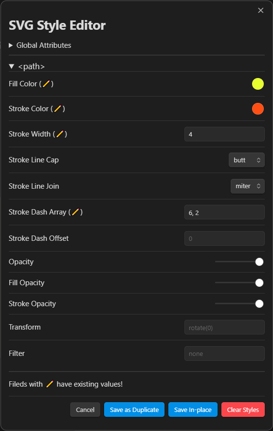

# Obsidian SVG Style Editor

Obsidian SVG Styler is a simple plugin designed to help you easily modify the style properties of SVG images directly within the editor. With this plugin, you can customize properties like color, border, opacity, and more. Supported drawable tags include: `path`, `line`, `rect`, `circle`, `ellipse`, and `polygon`.

  

### How to Use

1. Select your embedded SVG file (e.g., `![[my-icon.svg]]`).
2. Press `Ctrl + P` to open the command palette.
3. Type **SVG Styler** and press `Enter`.

  
Command Palette

  
  
SVG Styler Plugin

  

### Available Options

- **Save In-place**: Inserts new style properties directly into the original SVG file.
- **Save as Duplicate**: Creates a new copy of the SVG with the updated styles applied.
- **Clear Styles**: Removes any existing styles from the SVG.

# Changelog

### Version 1.0

- [x] Added functionality to remove existing styles from SVGs.
- [x] If an SVG contains a `<style>` tag, its values are now displayed as placeholders for easy reference.

### Version 1.1 (Current)

- [x] Introduced a Settings page with options for SVG handling:
  - [x] Option to duplicate SVGs to a specified location (Obsidian attachment folder or a custom path).
  - [x] Option to either modify the SVG in place or work on a duplicate version.
- [x] Added a feature to display the drawable SVG tags present in the file, allowing users to edit only the existing tags (e.g., `<path>`).

### Version 1.2 (Upcoming)

- [ ] Implement a Preset Manager within the settings page.
- [ ] Enable users to load, save, and remove style presets from both the settings and plugin interface.
- [ ] Improve the UI/UX of the tag style editor for a more streamlined experience.
